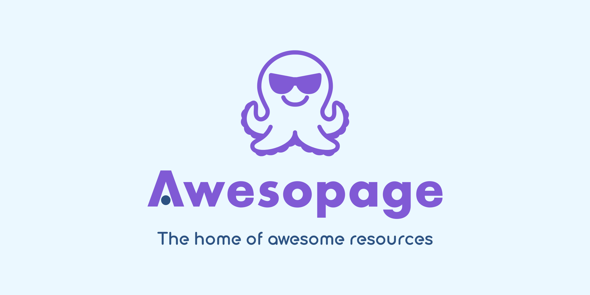

<div align="center">
  
</div>

# Awesopage

[](https://dl.circleci.com/status-badge/redirect/gh/awesopage/monorepo/tree/develop)
[](https://codeclimate.com/github/awesopage/monorepo/test_coverage)
[](https://codeclimate.com/github/awesopage/monorepo/maintainability)

## Tech stack

- [Next.js](https://nextjs.org)
- [Prisma](https://www.prisma.io) + [CockroachDB](https://github.com/cockroachdb/cockroach)
- [Playwright](https://playwright.dev)

## Development

### Set up environment

- Install Node.js v18.
- Install pnpm v7 https://pnpm.io/installation.
- Run `pnpm install` to install all dependencies.
- Run `pnpm install-tools` to install additional development tools.
- Run `pnpm boot` to bootstrap the environment.

### Manage local services (Docker Compose)

- Local services are defined in `docker/docker-compose-local.yaml`.
- To start the services, run `pnpm local-services start`.
- To stop the services, run `pnpm local-services stop`.
- To reset the services (all volumes will be deleted), run `pnpm local-services reset`.
- To tail logs of the services, run `pnpm local-services logs`.
- CockroachDB Console will be at http://localhost:4920.

### Manage database models (Prisma)

- Prisma schema is defined in `packages/pkg-app-model/schema/app.prisma`.
- To sync or create Prisma migrations, run `pnpm model-schema migrate`.
- To deploy Prisma migrations, run `pnpm model-schema deploy`.
- To reset data including migrations, run `pnpm model-schema reset`.
- To generate Prisma client, run `pnpm model-schema generate`.

### Start development

```
pnpm dev
```

- The application will be at http://localhost:4000.
- To create or reset test data, run `pnpm seed`.

### Run tests

- To run tests during development or debugging, use `pnpm test:start-app` and `pnpm test:run`.
- To run tests with auto start, cleanup and coverage collection in one command, use `pnpm test`.
- Playwright report is created in `output/test/playwright/html/index.html`.
- Coverage report is created in `output/test/coverage/report/index.html`.
- To serve test reports, run `pnpm serve output/test` then go to http://localhost:4444.

### Compile code (TypeScript)

```
pnpm compile
```

### Lint code

```
pnpm lint
```

### Clean workspace

```
pnpm clean
```

### Check outdated dependencies

```
pnpm outdated --recursive
```
